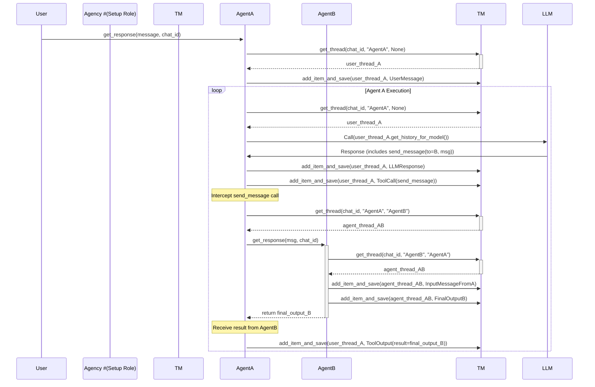

# Conversation Thread & Management Design (Task 3 - Revised)

This document outlines the revised design for managing conversation history and state in multi-agent interactions, reflecting the need for isolated, persistent threads per communication pair.

## 1. Goals

*   Provide explicit, isolated conversation histories for each communication channel (User <-> Agent, Agent A <-> Agent B).
*   Support persistence of threads across multiple runs/requests using user-provided callbacks and a `chat_id`.
*   Replace the single-thread concept and execution stack with a manager handling multiple `ConversationThread` instances.
*   Integrate cleanly with the Agent-centric orchestration logic within `agency_swarm.Agent`.

## 2. Proposed Classes

### 2.1. `ConversationThread`

This class now represents the message history for a *single, specific* communication pair within a given `chat_id`.

```python
from typing import List, Dict, Optional, Any, Sequence
from dataclasses import dataclass, field

# Assuming RunItem type is available from the SDK
from agents import RunItem, TResponseInputItem # Placeholder imports

@dataclass
class ConversationThread:
    """Holds the sequence of messages for a specific conversation pair."""
    thread_id: str # Unique identifier (e.g., combining chat_id and participant names)
    items: List[RunItem] = field(default_factory=list)
    metadata: Dict[str, Any] = field(default_factory=dict) # Optional metadata

    def add_item(self, item: RunItem) -> None:
        """Appends a RunItem (message, tool call, etc.) to the history."""
        self.items.append(item)
        # Persistence is handled by the ThreadManager after modification

    def add_items(self, items: Sequence[RunItem]) -> None:
        """Appends multiple RunItems to the history."""
        self.items.extend(items)
        # Persistence is handled by the ThreadManager after modification

    def get_history_for_model(self) -> List[TResponseInputItem]:
        """Gets the history formatted for the OpenAI API model input.

        Returns:
            A list of items formatted for the model provider.
        """
        # TODO: Implement robust conversion based on SDK capabilities (e.g., ItemHelpers).
        # This version provides the *entire* history for this specific pair's thread.
        formatted_history = []
        for item in self.items: # Placeholder conversion
             # Use appropriate helper from SDK to convert RunItem subclasses
             if hasattr(item, 'to_openai_input'): # Simplistic check
                 formatted_history.append(item.to_openai_input())
        # TODO: Consider max_items/token limits if necessary at this stage.
        return formatted_history

    def get_full_log(self) -> List[RunItem]:
        """Returns the complete, raw list of RunItems for this thread."""
        return list(self.items)

    # No execution stack needed here anymore. The program's call stack manages recursion.
```

### 2.2. `ThreadManager`

This new component handles the creation, retrieval, and persistence of all `ConversationThread` instances. It could be part of the `Agency` or a standalone utility.

```python
from typing import Callable, Optional, Tuple

# Placeholder imports
# from .persistence import ThreadLoadCallback, ThreadSaveCallback
ThreadLoadCallback = Callable[[str], Optional[ConversationThread]]
ThreadSaveCallback = Callable[[ConversationThread], None]

class ThreadManager:
    """Manages retrieval, creation, and persistence of ConversationThreads."""

    def __init__(
        self,
        load_callback: Optional[ThreadLoadCallback] = None,
        save_callback: Optional[ThreadSaveCallback] = None
    ):
        self._threads: Dict[str, ConversationThread] = {} # In-memory cache
        self._load_callback = load_callback
        self._save_callback = save_callback

    def _generate_thread_key(self, chat_id: str, participant1: str, participant2: Optional[str] = None) -> str:
        """Generates a consistent key for a thread based on participants."""
        if participant2:
            # Sort names to ensure consistent key regardless of order (A->B vs B->A)
            p1, p2 = sorted([participant1, participant2])
            return f"{chat_id}__{p1}__{p2}"
        else:
            # User interaction thread (only one agent participant)
            return f"{chat_id}__{participant1}__USER"

    def get_thread(self, chat_id: str, agent_name: str, other_participant_name: Optional[str] = None) -> ConversationThread:
        """
        Gets or creates a ConversationThread for the given participants.

        Args:
            chat_id: The user-defined identifier for the overall interaction.
            agent_name: The name of one agent participant.
            other_participant_name: The name of the other agent, or None if interacting with the user.

        Returns:
            The ConversationThread instance.
        """
        thread_key = self._generate_thread_key(chat_id, agent_name, other_participant_name)

        # 1. Check cache
        if thread_key in self._threads:
            return self._threads[thread_key]

        # 2. Try loading from persistence
        if self._load_callback:
            loaded_thread = self._load_callback(thread_key)
            if loaded_thread:
                self._threads[thread_key] = loaded_thread # Cache it
                return loaded_thread

        # 3. Create new thread if not found
        new_thread = ConversationThread(thread_id=thread_key)
        self._threads[thread_key] = new_thread
        # No immediate save needed, save happens after modification

        return new_thread

    def save_thread(self, thread: ConversationThread) -> None:
        """Saves the thread state using the provided callback."""
        if self._save_callback:
            self._save_callback(thread)
        # Update cache (though it should already be the same object)
        self._threads[thread.thread_id] = thread

    def add_item_and_save(self, thread: ConversationThread, item: RunItem) -> None:
        """Adds an item and triggers saving."""
        thread.add_item(item)
        self.save_thread(thread)

    def add_items_and_save(self, thread: ConversationThread, items: Sequence[RunItem]) -> None:
        """Adds multiple items and triggers saving."""
        thread.add_items(items)
        self.save_thread(thread)
```

## 3. Key Design Decisions:

*   **Thread per Pair:** Each `ConversationThread` instance strictly represents the history between two participants (User-Agent or Agent-Agent) for a specific `chat_id`.
*   **Isolation:** History is inherently isolated. Agent A interacting with User has a different thread object than Agent A interacting with Agent B.
*   **Persistence via Callbacks:** Thread persistence relies entirely on user-provided `load` and `save` callbacks, identified by a composite key derived from `chat_id` and participant names.
*   **`ThreadManager`:** Centralizes thread retrieval, creation, caching (in-memory), and persistence logic. An instance of this manager will likely be created/configured by the `Agency`.
*   **Agent Integration:** The `agency_swarm.Agent`'s `get_response` method will use the `ThreadManager` to fetch the correct `ConversationThread` before starting its execution loop or when handling a `send_message` call. After adding items, the agent logic will call `ThreadManager.save_thread`.
*   **No Execution State:** The `ConversationThread` **does not** manage an execution stack. The program's call stack handles the recursive flow of `Agent.get_response` calls.

## 4. Sequence Diagram Integration:

The previous sequence diagrams are still conceptually valid, but the `Thread` participant now represents *multiple distinct thread objects* being accessed via the `ThreadManager`.



## 5. Open Questions/Refinements:

*   Where should the `ThreadManager` instance live? Managed by `Agency` seems logical.
*   Exact format of the `thread_key` for robustness.
*   Error handling within the `ThreadManager` (e.g., load/save callback failures).
*   Details of `RunItem` to `TResponseInputItem` conversion using SDK helpers.

This revised design directly addresses the need for isolated, persistent conversation histories per communication pair, forming a solid foundation for the Agent-centric orchestration model.
